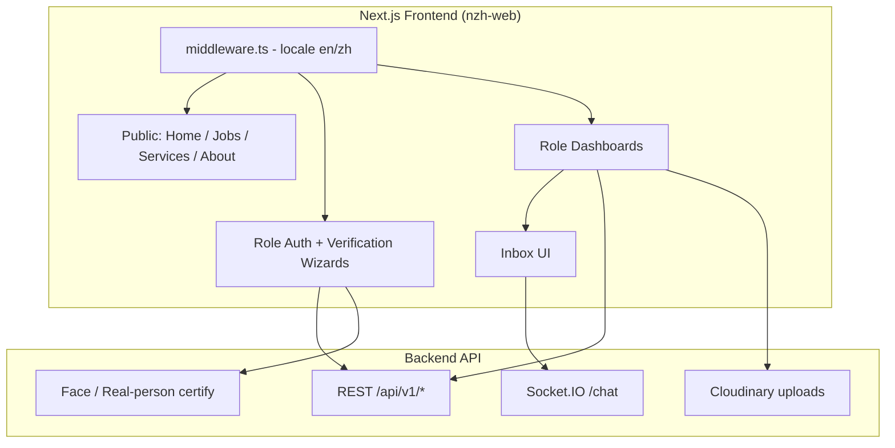

# New ZhengHe (NZH) — Portfolio Project Brief

> **Purpose of this file:** Single shareable brief for portfolio / ChatGPT writing.  
> **Repo:** `https://github.com/gtg-pro/nzh-web`  
> **Internal package name:** `zhenghe`  
> **Role (fill in):** Frontend Developer / Full-Stack Frontend  
> **Contributor:** Raheel (git authors: `raheelbaig`, `Raheel-afk`)  
> **Period (from git):** May 2026 – June 2026 (ongoing on `raheel-branch`)  
> **Live URL (fill in):** _______________________  
> **Screenshots folder:** `./portfolio-screenshots/`

---

## 1. Project Overview

**New ZhengHe (NZH)** is a cross-border employment and services platform that connects **Chinese talent** with **overseas employers**, while also supporting **institutions**, **employment agencies**, **commercial advertisers**, and **admins**.

Inspired by the explorer Zheng He, the product’s mission is to create a **safe, direct employment connection** between Chinese talent and employers in developed countries — reducing expensive intermediary / agency fees and shortening hiring time.

### Who uses it

| Persona                 | What they do on the platform                                                                                    |
| ----------------------- | --------------------------------------------------------------------------------------------------------------- |
| **Job Seeker**          | Signup + identity verification, profile setup, find/apply jobs, inbox chat, subscriptions                       |
| **Employer**            | Post jobs, search/shortlist candidates, assign agencies, inbox, billing                                         |
| **Employment Agency**   | Manage employer relationships, invitations, impersonation workflows, inbox                                      |
| **Institution**         | Verify org, upload/manage candidate data records, settings                                                      |
| **Commercial**          | Post and manage ads / commercial listings, billing                                                              |
| **Admin / Super Admin** | Approve entities, manage platform entities                                                                      |
| **Public visitors**     | Browse jobs, services (migration, study abroad, legal, consultation, courses), About, Contact, Phoenix Law page |

### Problem it solves

Traditional overseas employment for Chinese talent often involves:

- High agency fees (platform copy cites **~RMB 40,000 / ~USD 5,500**)
- Slow matching (months)
- Opaque intermediaries and limited resume pools

NZH positions itself as a **direct, lower-friction** marketplace with AI-assisted matching, real-time messaging, and supporting services (legal, migration, study abroad, etc.).

---

## 2. Screenshots

> Drop real product screenshots into `portfolio-screenshots/` using the filenames below.  
> Until then, ChatGPT can still write the portfolio using the captions + feature list.

### Recommended capture set

| #   | Filename                                | Screen / Caption                                                                            |
| --- | --------------------------------------- | ------------------------------------------------------------------------------------------- |
| 01  | `01-home-hero.png`                      | Marketing homepage hero — New ZhengHe brand, bilingual entry                                |
| 02  | `02-who-are-you.png`                    | “Who Are You?” persona cards (Job Seeker, Institution, Commercial, Employer, Agency, Donor) |
| 03  | `03-jobs-listing.png`                   | Public / seeker job discovery UI                                                            |
| 04  | `04-job-seeker-dashboard.png`           | Job seeker overview / find jobs dashboard                                                   |
| 05  | `05-job-seeker-signup-verification.png` | Multi-step signup: email/phone OTP + real-person / face verification                        |
| 06  | `06-employer-dashboard.png`             | Employer overview — stats, job listings, candidates                                         |
| 07  | `07-employer-create-job.png`            | Create / manage job posting form                                                            |
| 08  | `08-agency-dashboard.png`               | Agency dashboard — employers management                                                     |
| 09  | `09-institution-dashboard.png`          | Institution overview + uploaded data / upload modals                                        |
| 10  | `10-commercial-ads.png`                 | Commercial manage-ads / post new ad                                                         |
| 11  | `11-inbox-chat.png`                     | Real-time inbox (Socket.io chat)                                                            |
| 12  | `12-admin-approvals.png`                | Admin approvals / manage entities                                                           |
| 13  | `13-services-legal.png`                 | Services marketplace (e.g. Legal / Migration / Study Abroad)                                |
| 14  | `14-phoenix-law.png`                    | Standalone Phoenix Law Corporation page                                                     |
| 15  | `15-zh-locale.png`                      | Same key screen in **中文** locale                                                          |

### Markdown embeds (for portfolio site / ChatGPT)

```markdown


```

### Screenshot tips

- Prefer desktop 1440–1600px width + 1–2 mobile shots of home and a dashboard.
- Blur real emails, phone numbers, ID numbers, and live candidate PII.
- Capture EN and at least one ZH screen to prove i18n work.

---

## 3. Architecture

### High-level system

```text
┌─────────────────────────────────────────────────────────────┐
│                     Browser (Next.js App)                    │
│  locale routing (en | zh) · dashboards · public marketing   │
└───────────────┬─────────────────────────────┬───────────────┘
                │ REST (Bearer JWT)           │ Socket.IO
                ▼                             ▼
┌──────────────────────────────┐   ┌──────────────────────────┐
│   Backend API                │   │  Chat namespace            │
│   NEXT_PUBLIC_API_URL        │   │  /chat                   │
│   /api/v1/{role}/...         │   │  real-time messaging     │
└───────────────┬──────────────┘   └──────────────────────────┘
                │
                ▼
        DB / Auth / Storage
        (images via Cloudinary)
```

### Frontend stack

| Layer          | Choice                                                               |
| -------------- | -------------------------------------------------------------------- |
| Framework      | **Next.js 16** (App Router) + **React 19**                           |
| Language       | **TypeScript**                                                       |
| Styling        | **Tailwind CSS 4**, CVA, clsx, lucide/react-icons                    |
| i18n           | **next-intl** — locales `en`, `zh`                                   |
| HTTP           | Central `apiClient` (`src/utils/apiClient.ts`) + axios in places     |
| Auth           | JWT in localStorage/sessionStorage; role-aware 401 logout redirects  |
| Realtime       | **socket.io-client** (`src/services/chat/socketService.ts`)          |
| Maps           | Google Maps (`@react-google-maps/api`)                               |
| Charts         | Chart.js                                                             |
| Media          | Cloudinary image domains; crop/upload flows                          |
| Bot protection | Cloudflare Turnstile (`react-turnstile`)                             |
| DnD            | `@dnd-kit/*`                                                         |
| Deploy         | GitHub Actions → SSH → `npm run build` → **PM2** restart (`nzh-web`) |

### App structure (key folders)

```text
src/
├── app/[locale]/          # Locale-aware App Router
│   ├── (main)/            # Public marketing, jobs, services, legal pages
│   ├── (jobSeeker)/       # Signup, login, face verification, profile setup
│   ├── (employer)/        # Employer auth + verification
│   ├── (agency)/          # Agency auth + verification
│   ├── (Institution)/     # Institution auth + verification
│   ├── (commercial)/      # Commercial auth + verification
│   ├── job-seeker-flow/   # Seeker dashboard
│   ├── employer-dashboard/
│   ├── agency-dashboard/
│   ├── institution-dashboard/
│   ├── commercial-dashboard/
│   ├── admin-dashboard/
│   └── super-admin-login/
├── components/            # Shared UI + feature-specific components
├── contexts/              # Auth, Chat, role contexts, Language
├── services/              # Domain API modules per role/feature (~176 TS files)
├── messages/{en,zh}/      # Split i18n JSON (mainPages, jobs, dashboards, auth, …)
├── hooks/, utils/, types/, assets/
├── middleware.ts          # next-intl locale middleware
└── navigation.ts          # locales: en, zh
```

### Multi-role product modules

**~131 `page.tsx` routes** under `[locale]`, including:

1. **Job Seeker Flow** — overview, find jobs, applied, saved, inbox, plans/billing, visibility boost, profile
2. **Employer Dashboard** — jobs, candidate search, shortlist, agencies, inbox, billing
3. **Agency Dashboard** — find/manage employers, overview details, inbox, billing
4. **Institution Dashboard** — overview, uploaded-data, upload/delete/view modals, settings
5. **Commercial Dashboard** — manage ads, post ad, billing
6. **Admin** — approvals, manage entities
7. **Public Services** — migration, study abroad, preparation course, consultation, legal + company detail pages

### Auth & API pattern

- Tokens stored client-side; `Authorization: Bearer <token>`
- `userType` drives which login route to return to on 401
- Special case: **agency employer impersonation** — 401 does not force logout while `isImpersonating` is set
- Face verification flow: email OTP → phone OTP → real-person certify → camera **or QR fallback** → account registration → profile setup  
  (documented in `docs/job-seeker-signup-flow.md`)

### Architecture diagram (Mermaid)



---

## 4. Responsibilities (Raheel — Frontend)

> Derived from git history on `raheel-branch` / commits by `raheelbaig` + `Raheel-afk`.  
> Adjust wording if your official title or ownership differed.

### Ownership & feature delivery

1. **Institution Dashboard (built end-to-end UI)**
   - Overview, uploaded-data management, upload/delete/duplicate/view modals
   - Profile/settings (password, notifications)
   - Fixed institution UI polish and instant image-update issues

2. **Job Seeker onboarding / profile**
   - Job Preference & profile-setup improvements
   - Currency conversion / currency data updates
   - Field visibility rules (e.g. skills field handling)

3. **Cross-dashboard account lifecycle**
   - **Delete Account** implemented across dashboards
   - Delete-modal UI consistency
   - Editable email / update-email flows

4. **Realtime messaging UI**
   - Chat layout fixes, logo sizing, inbox UX polish

5. **Marketing & partner pages**
   - Standalone **Phoenix Law Corporation** page (design, FAQs, banners, responsiveness, routing)
   - About Us copy/content updates
   - Banner images and responsive banner fixes
   - Legal / service-details page fixes

6. **Commercial & i18n polish**
   - Job Preference & Commercial English fixes
   - Locale-aware UI work across EN/ZH surfaces

7. **General frontend quality**
   - Modal fixes, NaN/display bugs, image appearance issues
   - Autofill email bugs
   - Ongoing bugfix / UI polish from design review cycles

### How to describe this on a resume (short)

> Frontend developer on New ZhengHe — a bilingual multi-tenant employment marketplace. Owned the Institution dashboard, contributed to job-seeker preference/profile flows, cross-role account deletion, chat UI, and partner marketing pages (including Phoenix Law), shipping through a high-velocity PR workflow on a Next.js/React TypeScript codebase.

---

## 5. Challenges

### Product / domain challenges

1. **Many user types, one product**  
   Job seeker, employer, agency, institution, commercial, and admin each need distinct auth, verification, navigation, billing, and permissions — without fragmenting UX consistency.

2. **Trust & compliance for cross-border hiring**  
   Real-person / face verification, document uploads, and careful PII handling are required for job seekers and organizations.

3. **Bilingual experience (EN + 中文)**  
   Large copy surface (`src/messages/en|zh` — 11 JSON namespaces × 2 locales). UI must not break when Chinese strings are longer/shorter.

4. **Agency–employer collaboration**  
   Invitations, managed relationships, and impersonation create complex auth/session edge cases (e.g. 401 handling while impersonating).

### Engineering challenges (and how they were handled)

| Challenge                                  | Approach in codebase                                                     |
| ------------------------------------------ | ------------------------------------------------------------------------ |
| Locale routing without breaking deep links | `next-intl` middleware + `navigation.ts` (`en`/`zh`, `as-needed` prefix) |
| Centralized auth expiry across roles       | Shared `apiClient` with role-aware redirect on 401                       |
| Face verify without camera on desktop      | QR fallback page to continue certify on phone                            |
| Real-time chat across roles                | Socket.IO client with reconnect, token + `userType` auth                 |
| Large dashboard surface area               | Role-scoped `services/*` modules + feature folders under `app/[locale]`  |
| Image hosting / CDN                        | Cloudinary domain allowlist in Next image config                         |
| Fast iteration with design feedback        | Feature branch `raheel-branch` → frequent PRs into `develop`/`main`      |

### Personal / delivery challenges worth mentioning

- Owning a **new dashboard** (Institution) inside an already large multi-role app
- Keeping **modals, tables, uploads, and settings** consistent with existing employer/agency patterns
- Fixing subtle production UX bugs (NaN on cards, autofill, instant avatar/image refresh)
- Building a **standalone branded partner page** (Phoenix Law) to marketing/design specs while matching platform chrome

---

## 6. Metrics

### A) Product / market metrics (from platform copy — About / Home)

> Use as **product context**. Label them as platform claims / goals unless you have verified analytics.

| Metric                                   | Value (from product copy)                                                                                                      |
| ---------------------------------------- | ------------------------------------------------------------------------------------------------------------------------------ |
| Avg traditional agency fee (job seeker)  | **RMB 40,000 (~USD 5,500)** vs **No charges** on NZH (stated)                                                                  |
| Time to match — job seeker               | Agency **~2 months** → NZH goal **~1 week**                                                                                    |
| Time to match — company                  | Agency **~1 month** → NZH goal **~10 minutes**                                                                                 |
| Job positions (projected scale)          | Agency pools **~200** → NZH vision **~5 million**                                                                              |
| Countries (vision)                       | Agency **2–5** → NZH **30–50** developed countries                                                                             |
| Overseas Chinese context (2024)          | **60M** overseas; **20M** employed abroad; **$400B** annual generation; **35M** by 2030 (projected)                            |
| Homepage persona counters (marketing UI) | Job seekers **250,889** · Employers **20,889** · Commercial **1,088** · Agencies **250** · Institutions **21** · Donors **12** |

**Phase 1 markets (Active):** Singapore (initial), Japan, South Korea, Hong Kong.

### B) Engineering / contribution metrics (from git — Raheel)

| Metric                                                 | Value                          |
| ------------------------------------------------------ | ------------------------------ |
| Commits (combined `raheelbaig` + `Raheel-afk`)         | **~108**                       |
| Non-merge feature/fix commits                          | **~40+**                       |
| PRs merged from `raheel-branch` (log matches)          | **~36**                        |
| Approx. lines touched (additions+deletions, non-merge) | **~10,600+**                   |
| Active contribution window (git dates)                 | **2026-05-10 → 2026-06-08**    |
| App routes (`page.tsx` under locale)                   | **~131**                       |
| Service API modules (TS files under `src/services`)    | **~176**                       |
| i18n message files                                     | **22** (11 namespaces × EN/ZH) |

### C) Optional metrics to fill with real data (recommended)

| Metric                               | Your number                             |
| ------------------------------------ | --------------------------------------- |
| Live production users / MAU          |                                         |
| Jobs posted / applications submitted |                                         |
| Chat messages / day                  |                                         |
| Lighthouse / Core Web Vitals         |                                         |
| Bug tickets closed                   |                                         |
| Pages you personally shipped         | Institution dashboard + Phoenix Law + … |
| Team size                            |                                         |

---

## 7. Tech Keywords (ATS / portfolio tags)

`Next.js` · `React 19` · `TypeScript` · `Tailwind CSS` · `next-intl` · `i18n (EN/ZH)` · `REST APIs` · `JWT Auth` · `Socket.IO` · `Real-time Chat` · `Multi-tenant Dashboards` · `Role-based UX` · `File Upload` · `Face / Identity Verification UX` · `QR Fallback Flows` · `Google Maps` · `Chart.js` · `Cloudinary` · `PM2` · `GitHub Actions CI/CD` · `Responsive UI` · `Design-to-Code`

---

## 8. One-paragraph portfolio blurb (ready to paste)

**New ZhengHe (NZH)** is a bilingual (English/Chinese) cross-border employment platform that connects Chinese talent with overseas employers, agencies, institutions, and commercial partners. Built with **Next.js, React, TypeScript, and Tailwind**, the product includes multi-role dashboards, job discovery/application flows, subscriptions/billing, document verification, and **real-time Socket.IO messaging**. As a frontend developer on the team, I **built the Institution dashboard**, improved job-seeker preference/profile flows (including currency handling), implemented **delete-account across dashboards**, polished chat UI, and delivered partner/marketing surfaces such as the **Phoenix Law Corporation** page — shipping through a high-velocity PR workflow against a large multi-tenant codebase.

---

## 9. Bullet points for LinkedIn / CV

- Developed and maintained frontend features for **New ZhengHe**, a multi-role overseas employment marketplace (job seekers, employers, agencies, institutions, commercial, admin).
- **Owned Institution Dashboard UI** — overview, data upload/management modals, settings, and image update reliability.
- Implemented **cross-dashboard Delete Account** flows and modal UX consistency.
- Enhanced **job preference / profile setup**, including currency conversion and bilingual copy fixes.
- Improved **real-time chat layout** and messaging UX (Socket.IO-powered inbox).
- Built the **Phoenix Law Corporation** standalone marketing page (responsive banners, FAQs, routing).
- Worked in a **Next.js App Router + next-intl (EN/ZH)** architecture with centralized JWT API client and role-aware auth redirects.

---

## 10. Notes for ChatGPT (when generating the final portfolio)

1. Product brand name: **New ZhengHe / NZH** (package: `zhenghe`).
2. Emphasize **multi-role + bilingual + verification + realtime chat** — those differentiate the project.
3. Raheel’s strongest ownership story: **Institution Dashboard** + **Phoenix Law page** + **delete account across dashboards**.
4. Do **not** invent production analytics; use Section 6A as product claims and 6B as engineering evidence.
5. Insert screenshots from `portfolio-screenshots/` when available; until then use captions from Section 2.
6. Keep tone professional, impact-focused, and specific — avoid generic “worked on frontend” language.
7. If asked for architecture, prefer the diagram in Section 3.

---

_Generated from the `nzh-web` codebase and git history for portfolio use. Update live URL, official job title, and verified product metrics before publishing._
