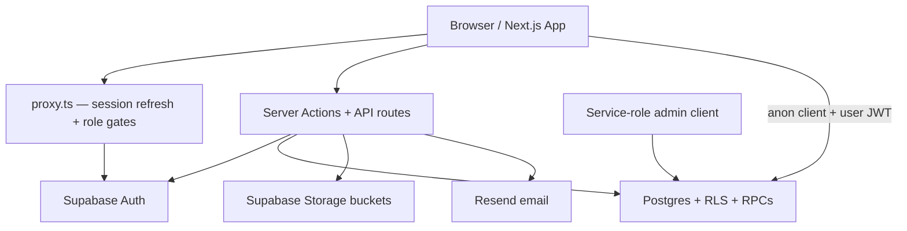

# SalHub — Portfolio Brief

> Hand this file to ChatGPT (or any portfolio writer) as the single source of truth for SalHub case-study content.
> Sections: Overview · Screenshots · Architecture · Responsibilities · Challenges · Metrics · Ready-to-paste blurb.

---

## 1. Overview

### Product

**SalHub** is a bilingual (EN/DE) marketplace for **business events and workshops**. Companies discover verified local providers, book services or packages, and manage the full process in one shared workspace.

**Tagline / positioning:** One place to discover, book, and coordinate everything.

### Problem it solves

Planning a business event usually means switching between messages, spreadsheets, emails, calls, and different tools — time-consuming and fragmented. SalHub connects provider discovery with project coordination in one place.

### Users / roles

| Role                                   | Purpose                                                                            |
| -------------------------------------- | ---------------------------------------------------------------------------------- |
| **Event organizers** (companies/teams) | Create events, browse providers/packages, send requests, run workspaces            |
| **Providers**                          | Onboard, list services/packages, receive orders, collaborate in request workspaces |
| **Partners** (affiliates)              | Refer providers and/or organizers; earn commission/bonuses                         |
| **Admins**                             | Approve accounts, review services/packages, manage partners/events                 |

### Core flow

Explore → Select → Send Requests → Manage in One Workspace.

### Monetization

- Commission-only for providers (no upfront fee).
- Rates vary by category and country (DE vs PT), roughly **3%–20%**.
- Partner revenue share (e.g. 20% of SalHub net commission until €100k project value, then 10%; client bonuses €100–€950).
- Integrated card payments (Stripe) are **not live yet** — payments handled off-platform for now.

### Repo / stack context

- Repo: `salhub-providers` (GitHub: `getweysofficial/Salhub`)
- **Next.js 16** (App Router) · **React 19** · **TypeScript** · **Tailwind CSS 4**
- **Supabase** (Auth, Postgres, RLS, Storage, RPCs)
- **Resend** (transactional email)
- Cloudflare **Turnstile** + honeypot + disposable-email block + rate limits (anti-spam)
- **Framer Motion**, Radix UI, Embla Carousel, signature_pad
- Custom **EN/DE** i18n
- Deployed with Vercel-oriented setup

### One-line portfolio framing

Built a multi-role Next.js 16 + Supabase marketplace for business-event providers and organizers, with RLS-backed booking workspaces, admin moderation, partner affiliates, Resend notifications, and category-based commission pricing across DE/PT markets.

---

## 2. Screenshots

### Important note

The repo has **marketing/brand assets**, not finished portfolio screenshots of the live UI. For a portfolio, capture real screens of the running app from the routes below.

### Recommended screenshot set (best order)

| #   | Route                                    | What to show                         | Why it belongs in a portfolio |
| --- | ---------------------------------------- | ------------------------------------ | ----------------------------- |
| 1   | `/`                                      | Home hero (video/image), brand, CTAs | Marketplace first impression  |
| 2   | `/find-providers`                        | Provider discovery / filters         | Core discovery UX             |
| 3   | `/find-providers/[id]`                   | Provider profile + services          | Detail / trust surface        |
| 4   | `/browse-packages`                       | Package grid                         | Package marketplace           |
| 5   | `/browse-packages/[id]`                  | Package detail                       | Conversion detail             |
| 6   | `/provider-pricing`                      | Commission catalog                   | Business model clarity        |
| 7   | `/become-provider`                       | Provider acquisition page            | Growth / onboarding           |
| 8   | `/provider/dashboard`                    | Provider overview                    | Provider console              |
| 9   | `/provider/dashboard/services`           | Service listing forms                | Complex domain forms          |
| 10  | `/provider/dashboard/orders/[requestId]` | Shared request workspace             | Collaboration after booking   |
| 11  | `/event-organizer/dashboard`             | Events list / create                 | Organizer console             |
| 12  | `/event-organizer/workspace/[id]`        | Event ops hub                        | Chat, tasks, files, timeline  |
| 13  | `/partner/dashboard`                     | Affiliate console                    | Partner growth loop           |
| 14  | `/admin/dashboard/providers`             | Moderation list                      | Admin / ops surface           |
| 15  | `/about`                                 | Product narrative                    | Story / mission               |

### Shot guidelines for ChatGPT / designer

- Capture **desktop** + at least **one mobile**.
- Prefer **EN** or **DE** consistently (don’t mix in one case study).
- Hide personal/client data; use demo accounts if needed.
- Include brand logo clearly in the first hero shot.
- Aim for 6–8 hero shots in the public portfolio; keep the rest as optional extras.

### Brand / marketing assets already in the repo

Use these for logos and atmosphere if needed:

**Logos**

- `public/Logos/images/Standard-Logo-Blue.png`
- `public/Logos/images/Standard-Logo-Black.png`
- `public/Logos/images/White-Logo-White.png`
- Favicon set under `public/Logos/images/Favicon/`

**Hero / marketing images**

- `public/images/hero-event.jpg`, `hero-event-v2.jpg`, `hero-event-v3.jpg`
- `public/images/hero-provider.jpg`
- `public/images/pricing-hero.jpg`, `pricing-trust.jpg`, `pricing-cta.jpg`
- `public/images/hero-video.mp4` (home hero video)

**Category cards**

- `cat-design.jpg`, `cat-venues.jpg`, `cat-catering.jpg`, `cat-beverage.jpg`, `cat-styling.jpg`, `cat-speakers.jpg`, `cat-av.jpg`, `cat-music.jpg`, `cat-team.jpg`, `cat-marketing.jpg`, `cat-tradefair.jpg`, `cat-photo.jpg`, `cat-more.jpg`

**Package imagery**

- `pkg-breakfast.jpg`, `pkg-meeting.jpg`, `pkg-networking.jpg`, `pkg-workshop.jpg`

### Full route inventory (for completeness)

**Public:** `/`, `/about`, `/contact`, `/become-provider`, `/provider-pricing`, `/find-providers`, `/find-providers/[id]`, `/find-providers/[id]/services/[serviceId]`, `/browse-packages`, `/browse-packages/[id]`, `/compare`, `/terms`, `/privacy-policy`, `/cookie-policy`, `/imprint`

**Provider:** `/provider/welcome`, `/provider/register`, `/provider/login`, `/provider/forgot-password`, `/provider/set-password`, `/provider/onboarding`, `/provider/dashboard`, `/provider/dashboard/profile|services|packages|portfolio|pricing|orders|calendar|documents|settings`, `/provider/dashboard/orders/[requestId]`

**Event organizer:** `/event-organizer`, `/event-organizer/auth/*`, `/event-organizer/dashboard`, `/event-organizer/dashboard/calendar`, `/event-organizer/dashboard/saved`, `/event-organizer/event/[id]`, `/event-organizer/event/[id]/request/[requestId]`, `/event-organizer/workspace/[id]`, `/event-organizer/join/[token]`

**Partner:** `/partner/register`, `/partner/login`, `/partner/forgot-password`, `/partner/set-password`, `/partner/terms`, `/partner/dashboard`, `/partner/dashboard/providers|add-provider|commissions|organizers|add-organizer|bonuses|settings`

**Admin:** `/admin/login`, `/admin/dashboard/providers`, `/providers/[id]`, `/services`, `/packages`, `/partners`, `/organizers`, `/events` (+ detail pages)

---

## 3. Architecture

### High-level diagram (Mermaid)

### How pieces connect

1. **Next.js App Router** renders public marketplace + four role dashboards.
2. **`proxy.ts`** refreshes sessions and gates protected prefixes by role (`/provider/dashboard`, `/admin/dashboard`, `/partner/dashboard`, `/event-organizer/...`).
3. **Layouts** re-check `getUser()`; e.g. providers must be `status = 'active'`.
4. **Supabase Auth** backs email/password login for all roles.
5. **Postgres + RLS** enforce ownership/membership; public read mainly for active listings.
6. **RPCs** drive request lifecycle (`create_event_request`, `respond_to_event_request`, `cancel_event_request`, etc.).
7. **Storage buckets** hold provider photos, service media, packages, portfolios, documents, signatures.
8. **Resend** sends invites, approvals, password resets, review decisions, new-request emails (secrets stay server-side via API routes).
9. **Unread badges** use ~15s polling + focus refetch (not Postgres Realtime channels).
10. **Anti-spam** on signup: Turnstile, honeypot, disposable-email blocklist, in-memory rate limit.

### Identity model

- `auth.users` → shared `public.users` (role, email, name, phone)
- Role-specific profiles: `providers`, `event_organizers`, `partners`
- Roles: `provider` | `customer` | `admin` | `partner` | `event_organizer`

### Folder map

| Path                                  | Role                                                                   |
| ------------------------------------- | ---------------------------------------------------------------------- |
| `app/`                                | Routes, server actions, API                                            |
| `components/`                         | UI by domain (provider, event-organizer, partner, admin, home, shared) |
| `lib/`                                | Domain logic, Supabase clients, security, email, i18n                  |
| `supabase/schema.sql` + `migrations/` | Full DB + incremental SQL                                              |
| `public/`                             | Logos, marketing images, hero video                                    |

### Major feature modules

1. **Public marketplace** — home, find providers, browse packages, become-provider, pricing, legal pages
2. **Provider console** — overview, profile, services, packages, portfolio, orders/workspaces, calendar, documents, settings
3. **Event organizer** — auth, events, team, calendar, saved items, event detail, request workspace, event workspace
4. **Shared request / booking workspace** — messages, tasks, timeline, files, read state (organizer ↔ provider)
5. **Partner affiliate console** — invite providers/organizers, commissions, bonuses, settings, signed city-partner agreement
6. **Admin console** — providers, services, packages, partners, organizers, events; approve/verify/suspend + emails
7. **Services & packages engine** — category-specific form schemas → jsonb `details`; admin review before public visibility
8. **Security / growth** — signup guard, referral attribution, cookie consent

### Systems checklist

| System        | Implementation                                                                                       |
| ------------- | ---------------------------------------------------------------------------------------------------- |
| Auth          | Supabase email/password; role-aware proxy + layout gates                                             |
| DB            | Postgres via Supabase; large schema + migrations                                                     |
| RLS           | Across users, providers, services, packages, organizers, events, requests, workspace tables, storage |
| APIs          | Next route handlers under `app/api/` (admin, notifications, signup-guard)                            |
| Payments      | Off-platform today; UI sections for payments/invoices; Stripe future                                 |
| Near-realtime | Polling for unread (not Realtime channels)                                                           |
| Storage       | Provider photos, service media, packages, portfolios, documents, signatures                          |
| Email         | Resend transactional suite                                                                           |
| i18n          | Custom EN/DE                                                                                         |

---

## 4. Responsibilities

> Edit these bullets to match the engineer’s exact ownership (frontend-only vs full-stack). They are written from the work evident in the SalHub codebase and commit history.

### Suggested portfolio bullets

- Built and maintained a **multi-role marketplace** (provider, organizer, partner, admin) with role-based routing and protected dashboards.
- Implemented **end-to-end organizer ↔ provider flows**: events, service/package requests, and shared workspaces (chat, tasks, files, timeline).
- Designed **category-driven service schemas** and listing/review flows so providers can publish structured offerings for admin approval.
- Delivered **partner affiliate system**: registration, referral invites, commissions/bonuses, and digital signature for partner terms.
- Built **admin moderation** surfaces: approve/verify providers, services, and packages; send decision emails.
- Shipped **provider pricing / commission catalog** (category + DE/PT variants) and marketing pages (home, become-provider, about).
- Integrated **Supabase Auth + RLS + Storage** and **Resend** for secure, server-side notifications.
- Added **anti-spam signup protection** (Turnstile, honeypot, disposable emails, rate limits).
- Improved UX across dashboards: data tables, calendars, unread badges, gallery carousels, bilingual UI.
- Separated partner dashboards by type; improved organizer/provider flows; referral-link attribution.

### Delivery milestones reflected in the product

1. Auth + provider foundation
2. Event-organizer UI and auth
3. End-to-end organizer ↔ provider system
4. Shared workspace (chats, files, timeline, tasks)
5. Admin panel restructure + review workflows
6. Partner flows, terms, digital signature, referrals
7. Pricing pages / commission catalogs
8. Anti-spam signup + polish (calendar, badges, AV nested services, speaker topics, etc.)

---

## 5. Challenges

| Challenge                          | Why it was hard                                                | How it was handled                                                                                |
| ---------------------------------- | -------------------------------------------------------------- | ------------------------------------------------------------------------------------------------- |
| **Multi-role platform in one app** | Four UX + auth models sharing one DB                           | Role-aware proxy, layout gates, role-specific profiles and dashboards                             |
| **Secure data access**             | Public listings vs private workspaces                          | Heavy RLS, membership helpers (`is_event_member`, etc.), careful service-role use for admin/email |
| **Booking / request lifecycle**    | Create → respond → cancel → workspace side-effects             | Postgres RPCs + status-driven UI                                                                  |
| **Flexible service catalog**       | Many categories, nested options (e.g. AV with nested listings) | Typed TypeScript schemas → jsonb `details` with admin review gates                                |
| **Near-realtime collaboration**    | Chat/unread without full Realtime complexity                   | 15s polling + focus refetch for unread badges                                                     |
| **Abuse on public signup**         | Fake/spam accounts                                             | Turnstile + honeypot + disposable-email block + rate limits                                       |
| **Affiliate attribution**          | Partner types, invites, commissions                            | Referral codes, partner dashboards, admin-editable rates                                          |
| **Payments deferred**              | Commission model live; Stripe not yet                          | Pricing/commission UX + off-platform payment terms; payment UI stubs                              |
| **i18n breadth**                   | Marketing + all consoles in EN/DE                              | Custom i18n layer across product surfaces                                                         |
| **Schema evolution**               | Large platform growing in phases                               | Idempotent `schema.sql` + incremental migrations                                                  |

### Narrative version (for case-study prose)

The hardest part was shipping a **single product that behaves like four products** — marketplace, provider CRM-lite, organizer event ops, and affiliate admin — without leaking data across roles. That meant investing in **RLS and membership rules**, **RPC-driven request state**, and **role-specific UX**, while still iterating quickly on partner growth, anti-spam, and commission pricing before live payment rails.

---

## 6. Metrics

### Important honesty note

There are **no live traction metrics** (users, GMV, traffic) stored in the repository. Use **engineering / product metrics** below for the portfolio unless the client provides real traction numbers.

### Engineering / product metrics (from codebase)

| Metric                          | Value                                                            |
| ------------------------------- | ---------------------------------------------------------------- |
| Role dashboards                 | **4** (provider, organizer, partner, admin)                      |
| Languages                       | **EN + DE**                                                      |
| Markets reflected in pricing    | **Germany + Portugal**                                           |
| Provider commission range       | **~3%–20%** by category                                          |
| Package commission              | **15% DE / 13% PT**                                              |
| Partner revenue share           | **20% → 10%** of SalHub net commission after €100k project value |
| Partner client bonuses          | **€100–€950** (per agreement terms)                              |
| Min event value (partner terms) | **€2,500**                                                       |
| Signup rate limit               | **5/hour, 15/day** per IP                                        |
| Unread poll interval            | **15 seconds**                                                   |
| Max package photos              | **5**                                                            |
| Portfolio/docs upload cap       | **~10 MB** / file                                                |
| Partner agreement term          | **2 years** (Germany / Cologne law referenced)                   |
| Domain tables (approx.)         | **~25+** with RLS                                                |
| Schema scale                    | Large `schema.sql` (~2700+ lines) + migrations                   |
| App surface                     | Hundreds of TS/TSX files across `app/`, `components/`, `lib/`    |

### Traction placeholders (fill if client allows)

| Metric                     | Value to fill                                |
| -------------------------- | -------------------------------------------- |
| Providers onboarded        | —                                            |
| Organizers / companies     | —                                            |
| Events created             | —                                            |
| Service requests completed | —                                            |
| Partners active            | —                                            |
| Markets live               | Germany (+ Portugal pricing)                 |
| Project timeline           | Multi-phase delivery across milestones above |

### How ChatGPT should talk about metrics

- Prefer **honest engineering scale** and **business-model numbers** (commissions, partner share).
- Do **not invent** user counts, revenue, or growth %.
- If traction numbers are provided later, put them in a “Results” subsection above the engineering metrics.

---

## 7. Ready-to-paste portfolio blurb

### Short (1 paragraph)

**SalHub** is a bilingual marketplace for business events. Companies discover verified providers, request services or packages, and coordinate everything in a shared workspace. I worked on a Next.js + Supabase multi-role platform (providers, organizers, partners, admins) covering auth, RLS-backed bookings, request workspaces (chat/tasks/files), affiliate referrals, admin moderation, commission pricing, and anti-spam signup — with EN/DE support for DE/PT markets.

### Medium (case-study intro)

SalHub helps companies plan business events without juggling spreadsheets, emails, and scattered tools. As part of the engineering team, I helped build a multi-role marketplace where organizers find verified providers, send service or package requests, and collaborate in a shared workspace — while providers manage listings and orders, partners grow the network via referrals, and admins review and approve supply. The stack is Next.js 16, React 19, TypeScript, Tailwind, and Supabase (Auth, Postgres RLS, Storage), with Resend for transactional email and Turnstile-based signup protection. Key challenges included role-based security, a flexible category-driven service catalog, affiliate attribution, and shipping collaboration features before live payment rails.

### Bullet summary for resume

- Multi-role event marketplace (Next.js, Supabase, RLS)
- Organizer ↔ provider request workspaces (chat, tasks, files, timeline)
- Partner affiliate referrals, commissions, digital agreements
- Admin moderation + Resend notifications
- EN/DE i18n; DE/PT commission pricing; anti-spam signup

---

## 8. Instructions for ChatGPT (how to use this file)

When rewriting for a portfolio / resume / case study:

1. Keep the **product truth** above; don’t invent features or metrics.
2. Adapt **tone** to the target site (formal case study vs casual personal site).
3. Shorten **Responsibilities** to 4–6 strongest bullets for resume; expand for case study.
4. Use the **screenshot route list** as a capture checklist; don’t claim screenshots exist in-repo as UI captures.
5. Prefer the **short blurb** for cards; **medium** for project pages.
6. If the user provides their exact job title, team size, dates, or traction numbers, merge them into Overview + Metrics without contradicting this brief.
   )
