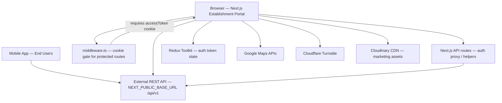

# StrangerUs — Portfolio Brief

> Hand this file to ChatGPT (or any portfolio writer) as the **single source of truth** for StrangerUs case-study content.
> Sections: Overview · Screenshots · Architecture · Responsibilities · Challenges · Metrics · Ready-to-paste blurbs · Instructions.

---

## 1. Overview

### Product

**StrangerUs** is a location-based social platform that connects nearby strangers at real-world venues (cafés, gyms, bookstores, restaurants, hangouts) — and gives those venues a business console to attract foot traffic through check-ins, discovery, events, jobs, and insights.

**Tagline / positioning:** Finding Connection in a Crowded World.

### Problem it solves

Crowded cities still feel lonely. Dating/social apps optimize for profiles, bios, and swipes. Venues stay quiet without promotions or events. StrangerUs connects **people through presence** (who is nearby / on-site right now) and turns venues into live social connection zones.

### Two-sided product

| Side               | Surface                          | Purpose                                                                                      |
| ------------------ | -------------------------------- | -------------------------------------------------------------------------------------------- |
| **Users**          | Mobile app                       | Discover venues, check in, meet nearby like-minded people, get deals/experiences             |
| **Establishments** | This web app (`stranger-us-web`) | List venue, manage profile, QR check-ins, events/jobs, reviews, analytics, discovery control |

### Users / roles

| Role                        | Purpose                                                           |
| --------------------------- | ----------------------------------------------------------------- |
| **End users (app)**         | Find spots, check in, connect with strangers nearby               |
| **Establishments / venues** | Register, complete profile, drive foot traffic, manage ops        |
| **Public visitors**         | Browse marketing site, benefits, comparison, contact, legal pages |

### Core flows

- **Users:** Discover → Check in → Meet nearby strangers → Real-world connection
- **Establishments:** Email verify → OTP → Sign up → Business profile onboarding → Dashboard ops (QR, events, jobs, reviews, discovery)

### Product positioning vs alternatives

StrangerUs emphasizes **presence over profiles**, **in-venue discovery**, and real-world connection — not swiping, scheduling, or status feeds. Compared against generic discovery/social tools (marketing comparison page includes competitors like Yelp-style discovery).

### Repo / stack context

- Repo: `stranger-us-web` (GitHub: `gtg-pro/stranger-us-web`)
- Package name: `stranger-us`
- **Next.js 15** (App Router, Turbopack in dev) · **React 19** · **TypeScript** · **Tailwind CSS 4**
- **Redux Toolkit** (auth tokens)
- **Google Maps** (`@react-google-maps/api`, `@googlemaps/js-api-loader`) for address/location
- **Recharts** for dashboard visitor traffic charts
- **Cloudflare Turnstile** (`react-turnstile`) for anti-spam signup
- **js-cookie** + Next middleware for protected routes
- **Cloudinary** for marketing/UI imagery CDN
- External **REST API** via `NEXT_PUBLIC_BASE_URL` (`/api/v1/...`)
- Mentions **Stripe** in cookie/privacy policy for payment processing (billing/subscription UI present)
- Font: **Montserrat**
- Contact shown in product: `support@strangerus.com` (plus privacy/GDPR emails on legal pages)

### One-line portfolio framing

Built the establishment-facing Next.js 15 portal for StrangerUs — marketing site plus authenticated venue console with auth/onboarding, QR check-ins, events & jobs, reviews, discovery scheduling, and analytics — integrated with a REST backend, Google Maps, and Cloudflare Turnstile.

---

## 2. Screenshots

### Important note

The repo has **logos, icons, and Cloudinary-hosted marketing assets**, not finished portfolio screenshots of the live UI. For a portfolio, capture real screens of the running app / deployed site from the routes below.

### Recommended screenshot set (best order)

| #   | Route                                                                                           | What to show                                                         | Why it belongs in a portfolio    |
| --- | ----------------------------------------------------------------------------------------------- | -------------------------------------------------------------------- | -------------------------------- |
| 1   | `/`                                                                                             | Home hero (“Meet Strangers Nearby You” / establishment CTA carousel) | Brand + product first impression |
| 2   | `/#features-section`                                                                            | Features tabs: Users vs Establishments                               | Dual-audience product clarity    |
| 3   | `/#users-section`                                                                               | User value props + animated stats + app store buttons                | Consumer side + traction story   |
| 4   | `/establishment-benefits`                                                                       | “Your New Source For Customers” landing                              | B2B acquisition surface          |
| 5   | `/comparison`                                                                                   | Competitive comparison (“What Makes Us Unique”)                      | Positioning / differentiation    |
| 6   | `/aboutus`                                                                                      | Origin story (lonely cities → launch cities)                         | Narrative / mission              |
| 7   | `/auth/email-verification` → OTP → sign-up                                                      | Auth & verification flow                                             | Trust / onboarding start         |
| 8   | `/auth/login`                                                                                   | Establishment login                                                  | Auth surface                     |
| 9   | Business profile onboarding (`/setBusinessProfile/businessDetailsForm` … subscription → review) | Multi-step venue setup                                               | Complex form UX                  |
| 10  | `/setBusinessProfile/dashboard`                                                                 | Check-ins, hours, rating, visitor traffic chart                      | Ops analytics                    |
| 11  | `/setBusinessProfile/jobTracker`                                                                | Establishment QR (“Scan to check-in”)                                | Core venue mechanic              |
| 12  | `/setBusinessProfile/postEvent` (+ event detail)                                                | Events list + RSVP/check-in + event QR                               | Events ops                       |
| 13  | `/setBusinessProfile/postJob`                                                                   | Job listings management                                              | Hiring / listings feature        |
| 14  | `/setBusinessProfile/review`                                                                    | Reviews & ratings                                                    | Reputation surface               |
| 15  | Navbar discovery / hide schedule modal                                                          | Scheduled hide/show discovery                                        | Unique venue control feature     |

### Shot guidelines for ChatGPT / designer

- Capture **desktop** + at least **one mobile**.
- Hide personal/client data; use demo accounts if needed.
- Include brand logo clearly in the first hero shot (`public/logo.svg` / `logo-white.svg`).
- Aim for **6–8** hero shots in the public portfolio; keep the rest as optional extras.
- Prefer consistent purple/lavender brand accent (`#BE93D4` family) as seen in UI.

### Brand / marketing assets already in the repo

**Logos**

- `public/logo.svg`
- `public/logo-white.svg`
- Favicon / icons referenced in layout (`/favicon.ico`, `/icon.png`)

**Local UI assets**

- `src/assets/` — dashboard icons, sidebar icons, users stats icons, comparison icons, postEvent/postJob icons, etc.

**Cloudinary marketing imagery** (used throughout landing/features)

- Hero backgrounds and feature illustrations hosted on Cloudinary (referenced from components under `src/components/landingPage/`, `aboutUs/`, `establishentBenefits/`, `comparisonPage/`).

### Full route inventory (for completeness)

**Public / marketing**

- `/` — landing
- `/aboutus` — about
- `/establishment-benefits` — venue benefits
- `/comparison` — compare / unique value
- `/contact` — contact
- `/privacy-policy`, `/termOfServices`, `/cookiesSettings` — legal

**Auth**

- `/auth/email-verification`
- `/auth/email-verification/verify-otp` (+ success)
- `/auth/verify-otp`
- `/auth/sign-up` (+ success)
- `/auth/login`
- `/auth/forget-password`
- `/auth/forget-password/reset-password` (+ success)

**Establishment console (protected by middleware cookie `accessToken`)**

- `/setBusinessProfile` (entry)
- `/setBusinessProfile/dashboard`
- `/setBusinessProfile/review` (+ `/review/[id]`)
- `/setBusinessProfile/jobTracker` (QR)
- `/setBusinessProfile/postEvent` (+ create / `[id]`)
- `/setBusinessProfile/postJob` (+ create / `[id]`)
- `/setBusinessProfile/manageBusiness`
- `/setBusinessProfile/businessDetailsForm` (+ addCustomItems → selectSubscription → reviewForm → success)
- `/setBusinessProfile/subscriptionPlan`
- `/setBusinessProfile/manageBilling`
- `/setBusinessProfile/manageNotifications`
- `/setBusinessProfile/changePassword`
- `/upload`

---

## 3. Architecture

### High-level diagram (Mermaid)

### How pieces connect

1. **This repo is the establishment web portal** (marketing + authenticated business console). End-user social features live primarily in the mobile app against the same backend family.
2. **Next.js App Router** renders public marketing pages and the `/setBusinessProfile/*` console.
3. **`middleware.ts`** protects `/setBusinessProfile/*` and `/upload/*` by requiring an `accessToken` cookie; otherwise redirects to `/auth/login?from=...`.
4. **Auth tokens** are stored in cookies (for middleware), localStorage, and Redux (`authSlice`).
5. **Next API routes** under `src/app/api/` proxy sensitive auth calls (login/logout/forget-password) and helpers (email existence, Cloudflare) to the external API and set cookies on success.
6. **Business features** call REST endpoints with `Authorization: Bearer <token>` for dashboard, profiles, uploads, hides/schedules, events, jobs, QR generation, reviews, notifications, unlock/boost, etc.
7. **Google Maps** powers address autocomplete / lat-long for venue profiles.
8. **Turnstile** hardens public signup against bots.
9. **Discovery scheduling** uses client schedule utils + hide APIs to auto hide/show the establishment during configured windows.

### Identity / auth model

- Establishment auth endpoints under `/api/v1/auth/establishments/*` (signup, signin, forget/reset password)
- Email verification + OTP before/around registration
- Establishment status checks (e.g. `isVerified`, `isRegistered`) drive redirects after verification
- Layout under `setBusinessProfile` can fetch `/api/v1/establishments/details` to gate incomplete profiles

### Folder map

| Path                                     | Role                                                        |
| ---------------------------------------- | ----------------------------------------------------------- |
| `src/app/`                               | Routes: marketing, auth, establishment console, API routes  |
| `src/components/`                        | Landing, about, benefits, comparison, animations, shared UI |
| `src/app/setBusinessProfile/components/` | Console UI (forms, sidebar, charts, modals, uploads)        |
| `src/store/`                             | Redux provider + `authSlice`                                |
| `src/lib/`                               | Token utils, hide/discovery helpers, schedule utils         |
| `src/assets/`                            | Local SVG/PNG icons and illustrations                       |
| `public/`                                | Logos and static public assets                              |
| `src/middleware.ts`                      | Cookie-based route protection                               |

### Major feature modules

1. **Marketing site** — hero carousel, features (users/establishments), users stats, popular establishments, ready-to-join, footer/app download
2. **Benefits / comparison / about** — venue acquisition narrative + differentiation
3. **Auth** — email verification, OTP, signup, login, password reset
4. **Onboarding** — business details, Google address, media upload, custom items, subscription selection, review & submit
5. **Dashboard analytics** — active check-ins vs target, total check-in hours, average rating, date-range visitor traffic chart
6. **QR check-in** — generate establishment/event QR codes for scanning
7. **Events** — create/manage events, RSVPs, attendance/check-ins, event QR
8. **Jobs** — create/manage job listings with table filters/search
9. **Reviews & ratings** — view/manage feedback
10. **Discovery control** — toggle hide + schedule hide periods with automatic enforcement
11. **Notifications / billing / subscription / settings** — console account management
12. **Security helpers** — Turnstile, cookie consent/legal pages

### Systems checklist

| System           | Implementation                                                     |
| ---------------- | ------------------------------------------------------------------ |
| Auth             | Establishment email/password + OTP; cookies + localStorage + Redux |
| Route protection | Next middleware on `/setBusinessProfile`, `/upload`                |
| Backend          | External REST (`NEXT_PUBLIC_BASE_URL`)                             |
| Maps             | Google Maps autocomplete / geocoding for venue address             |
| Charts           | Recharts bar chart for visitor traffic                             |
| Anti-bot         | Cloudflare Turnstile                                               |
| Media            | Establishment upload API + Cloudinary for marketing assets         |
| Payments         | Subscription/billing UI; Stripe referenced in legal copy           |
| Discovery        | Hide toggle + scheduled periods (`establishments/hides`)           |
| QR               | `/establishments/qrs/generate?typeId=...&type=establishment        | event` |

---

## 4. Responsibilities

> Edit these bullets to match the engineer’s exact ownership (frontend-only vs full-stack). They are written from the work evident in the StrangerUs web codebase and commit history themes.

### Suggested portfolio bullets

- Built and maintained the **StrangerUs establishment web portal** (Next.js 15 + TypeScript + Tailwind): public marketing site + authenticated venue console.
- Implemented **end-to-end establishment auth**: email verification, OTP, signup/login, forget/reset password, cookie middleware protection, and logout across cookies/localStorage/Redux.
- Delivered **multi-step venue onboarding**: business profile, Google Maps address, media uploads, custom items, subscription selection, and review/submit.
- Built the **operations dashboard** with live KPIs (active check-ins, check-in hours, average rating) and date-filtered visitor traffic charts.
- Implemented **QR check-in generation** for establishments and events, including API integration and fallbacks.
- Shipped **events and jobs management** (CRUD, search/filters, RSVP/check-in tracking, event detail views).
- Built **discovery control**: hide/show establishment plus scheduled hide windows with automatic toggle behavior.
- Added **reviews & ratings**, notification settings/inbox UI, billing/subscription screens, and account settings (password, manage business).
- Created marketing surfaces: landing, establishment benefits, comparison, about, contact, and legal pages with responsive layouts and scroll animations.
- Integrated **Google Maps**, **Cloudflare Turnstile**, and REST API consumption patterns across the console.

### Delivery milestones reflected in the product / git history themes

1. Marketing site + dual audience messaging (users vs establishments)
2. Auth + email/OTP verification
3. Business profile onboarding + uploads + maps
4. Dashboard analytics + charts
5. QR / barcode check-in flows
6. Events and jobs management + filters/search
7. Reviews and notifications
8. Establishment hide + scheduling features
9. Legal/privacy updates, footer/UX polish, build fixes

---

## 5. Challenges

| Challenge                                 | Why it was hard                                               | How it was handled                                                                                                                   |
| ----------------------------------------- | ------------------------------------------------------------- | ------------------------------------------------------------------------------------------------------------------------------------ |
| **Two-sided product in one brand**        | Consumer app story + venue B2B ops must not confuse users     | Separate marketing sections/tabs; dedicated benefits page; console isolated under `/setBusinessProfile`                              |
| **Auth across cookie + client state**     | Middleware needs cookies; client needs tokens for API calls   | Login API route sets cookies; tokens also stored in localStorage + Redux; logout clears all layers                                   |
| **Incomplete vs complete establishments** | Users may authenticate before finishing profile               | Status checks (`isVerified` / `isRegistered` / establishment details) drive redirects into onboarding vs dashboard                   |
| **Discovery scheduling**                  | Venues need temporary hide windows without manual babysitting | Schedule utils evaluate current date/time windows; UI auto-hides/shows and blocks conflicting manual toggles during active schedules |
| **Dense ops tables**                      | Events/jobs/reviews need usable management UX                 | Search, filtration, custom scrollbars, detail pages, confirmation modals                                                             |
| **QR reliability**                        | Check-in depends on scannable codes for venue and event types | API-generated QR data URIs with demo/fallback patterns if generation fails                                                           |
| **Location quality**                      | Wrong address hurts discovery and trust                       | Google Maps autocomplete + lat/long capture on profiles                                                                              |
| **Signup abuse**                          | Public registration attracts bots                             | Cloudflare Turnstile verification                                                                                                    |
| **Backend separation**                    | Web is BFF-ish over external REST, not a monolith DB app      | Next API proxies for auth/cookies; feature pages call `/api/v1` with bearer tokens                                                   |

### Narrative version (for case-study prose)

The hardest part was shipping a **venue operations product** that still tells a clear consumer story on the marketing site. That meant careful auth/session design across cookies and client state, a multi-step onboarding path for incomplete establishments, and practical ops features (QR, events, jobs, reviews) — plus a non-trivial discovery scheduler so venues can control visibility without fighting the system during planned hide windows.

---

## 6. Metrics

### Important honesty note

Landing-page counters are **product marketing figures coded in the UI**. Treat them as **claimed / aspirational marketing metrics** unless the client confirms they are live verified traction. Prefer engineering/product metrics for honesty if traction is unconfirmed.

### Marketing metrics shown on the site (`Users` section)

| Metric           | Value shown |
| ---------------- | ----------- |
| Active Users     | **25,000**  |
| APP Downloads    | **500+**    |
| Connections Made | **25,000**  |
| Spots Discovered | **500+**    |

### Launch / market narrative (About page)

- Idea started **late 2024**
- Build began **early 2025**
- First launch market: **Singapore**, followed by **New York, Sydney, and London**

### Engineering / product metrics (from codebase)

| Metric                            | Value                                                                                   |
| --------------------------------- | --------------------------------------------------------------------------------------- |
| App focus of this repo            | Establishment portal + marketing website                                                |
| Framework                         | Next.js **15.3**, React **19**, TypeScript                                              |
| Protected console areas           | Dashboard, reviews, QR, events, jobs, manage business, billing, notifications, settings |
| Auth surface                      | Email verify, OTP, signup, login, reset password                                        |
| Dashboard KPIs                    | Active check-ins / target, total check-in hours, average rating / 5                     |
| Dual feature audiences            | Users + Establishments                                                                  |
| Maps + anti-bot                   | Google Maps + Cloudflare Turnstile                                                      |
| Approx. TS/TSX files under `src/` | **~130**                                                                                |
| Brand accent                      | Lavender/purple (`#BE93D4` family)                                                      |

### Traction placeholders (fill if client allows)

| Metric                 | Value to fill                              |
| ---------------------- | ------------------------------------------ |
| Verified active users  | —                                          |
| Verified app downloads | —                                          |
| Establishments listed  | —                                          |
| Check-ins completed    | —                                          |
| Events created         | —                                          |
| Cities live            | Singapore (+ roadmap: NYC, Sydney, London) |
| Project timeline       | Late 2024 idea → 2025 build/launch phases  |

### How ChatGPT should talk about metrics

- Prefer **honest engineering scale** and clearly labeled marketing claims.
- Do **not invent** revenue, GMV, conversion rates, or growth percentages.
- If real traction numbers are provided later, put them in a “Results” subsection above the marketing counters and mark marketing numbers as website copy if they differ.

---

## 7. Ready-to-paste portfolio blurbs

### Short (1 paragraph)

**StrangerUs** is a location-based platform that helps people meet nearby strangers at real venues while giving cafés and spaces tools to drive foot traffic. I built the establishment-facing Next.js portal: marketing pages, auth/onboarding, analytics dashboard, QR check-ins, events and jobs, reviews, discovery scheduling, and account settings — integrated with a REST API, Google Maps, and Cloudflare Turnstile.

### Medium (case-study intro)

StrangerUs was born from loneliness in crowded cities: people want real-world connection, and venues want more walk-ins without constant promotions. As part of the engineering work on the web product, I helped build the establishment portal that sits beside the consumer mobile experience — covering email/OTP auth, multi-step venue onboarding, a metrics dashboard (check-ins, hours, ratings, traffic charts), QR-based check-ins, events and job listings, reviews, and scheduled discovery hide/show controls. The stack is Next.js 15, React 19, TypeScript, Tailwind, and Redux, talking to an external REST backend, with Google Maps for location and Turnstile for signup protection. Key challenges included dual-audience product clarity, session handling across cookies and client state, and making venue ops features reliable enough for day-to-day use.

### Bullet summary for resume

- Establishment portal for a location-based social / foot-traffic platform (Next.js, TypeScript)
- Auth + multi-step venue onboarding (OTP, Maps, uploads, subscriptions)
- Dashboard analytics, QR check-ins, events/jobs, reviews
- Discovery hide scheduling + notifications/billing settings
- Marketing site: landing, benefits, comparison, about

---

## 8. Instructions for ChatGPT (how to use this file)

When rewriting for a portfolio / resume / case study:

1. Keep the **product truth** above; don’t invent features, cities, or metrics.
2. Adapt **tone** to the target site (formal case study vs casual personal site).
3. Shorten **Responsibilities** to 4–6 strongest bullets for resume; expand for case study.
4. Use the **screenshot route list** as a capture checklist; don’t claim polished UI screenshots already exist in-repo.
5. Prefer the **short blurb** for project cards; **medium** for project pages.
6. If the user provides their exact job title, company (e.g. GoodToGo), team size, dates, or verified traction numbers, merge them into Overview + Metrics without contradicting this brief.
7. This brief is for **StrangerUs / stranger-us-web only** — not SalHub or other projects.
8. When mentioning stack, emphasize: **Next.js 15, React 19, TypeScript, Tailwind, Redux, Google Maps, Turnstile, REST API**.

---

## 9. Quick copy blocks (optional)

### Project title options

- StrangerUs — Establishment Portal
- StrangerUs Web — Venue Dashboard & Marketing Site
- StrangerUs: Real-World Connections for People & Places

### Role title placeholders

- Frontend Engineer
- Full-Stack Frontend Engineer (Next.js)
- Software Engineer — Establishment Web Platform

### Outcome sentence templates

- Helped venues turn walk-ins into discoverable social spaces through check-ins, QR, and visibility controls.
- Shipped a production-facing establishment console covering onboarding through day-to-day operations.
- Built dual-audience web surfaces that explain the consumer product while enabling B2B venue workflows.
